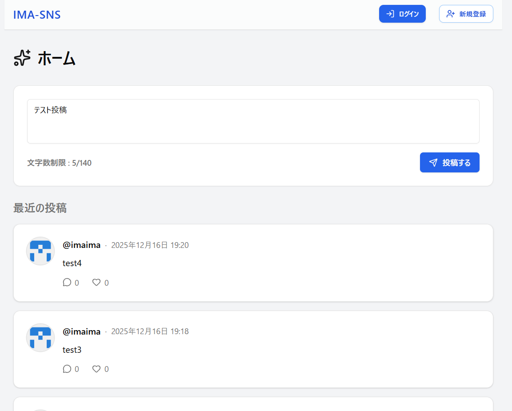

# Dummy-SNS （Next.js + TypeScript）

このプロジェクトは、Next.js と TypeScript を用いた SNS のダミーアプリケーションです。

- ヒーローページ
  

---

## 構成・技術スタック

- **Next.js**: React ベースのフレームワーク。`app/`ディレクトリ構成を採用。
- **TypeScript**: 型安全な開発を実現。
- **Tailwind CSS**: ユーティリティファーストな CSS フレームワーク。
- **コンポーネント設計**: `components/`配下に UI 部品や投稿関連のコンポーネントを配置。
- **認証機能**: `context/auth.tsx`で認証状態を管理。
- **API 通信**: `lib/apiClient.ts`で API クライアントを実装。
- **型定義**: `types/index.ts`で型を一元管理。

---

## 主なディレクトリ・ファイル

- `app/`: ルーティングとページコンポーネント（例：ログイン、サインアップ、プロフィール、投稿一覧など）
- `components/`: ナビゲーションバー、投稿カード、投稿フォームなどの再利用可能な UI 部品
- `context/`: グローバルな状態管理（主に認証）
- `hooks/`: カスタムフック（例：トースト通知用）
- `lib/`: API クライアントやユーティリティ関数
- `public/`: 静的ファイル
- `types/`: 型定義

---

## 代表的な機能

- ユーザー認証（ログイン・サインアップ）
- 投稿の作成・表示
- プロフィールページ

---
